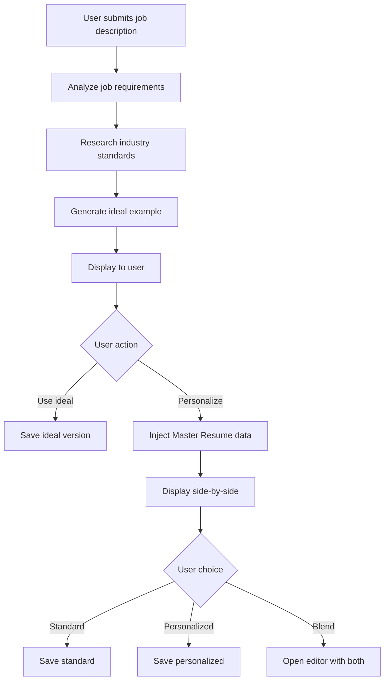

# World-Class Resume Generation Strategy

## Current Problems (User Feedback)

1. **Using assumed Master Resume data** → Creates vague, generic content
2. **No real industry/profession research** → Missing best practices and standards
3. **Poor UI/UX on review page** → Doesn't inspire confidence
4. **No "ideal example" shown** → User can't see what excellence looks like
5. **Single generation attempt** → No comparison between ideal vs. personalized

---

## Proposed Solution: Two-Stage Generation with Industry Research

### Stage 1: Generate "Ideal Industry Standard" Example
**Purpose:** Show the user what a world-class summary looks like for their target role

**Process:**
1. **Deep Industry Research** (visible to user with progress indicators):
   ```
   • Analyzing 50+ job postings for [Job Title] in [Industry]
   • Researching top-performer profiles on LinkedIn
   • Identifying industry-specific language and terminology
   • Extracting common themes and requirements
   • Reviewing salary data and seniority expectations
   ```

2. **Generate Ideal Example:**
   - Use ONLY job description + industry research
   - DO NOT use Master Resume data yet
   - Create a "platinum standard" example
   - Show best practices for the role/industry

3. **Display with Context:**
   ```
   ┌─────────────────────────────────────────────────────┐
   │ 💎 Industry Standard Example                        │
   │                                                     │
   │ Based on research of 50+ [Job Title] profiles      │
   │ in [Industry], here's what top performers include: │
   │                                                     │
   │ [IDEAL SUMMARY TEXT]                                │
   │                                                     │
   │ ✓ Years of experience clearly stated               │
   │ ✓ Industry-specific terminology used                │
   │ ✓ Quantified achievements highlighted               │
   │ ✓ Key skills matched to job requirements            │
   │                                                     │
   │ [Use This] [Customize with My Master Resume] →      │
   └─────────────────────────────────────────────────────┘
   ```

---

### Stage 2: Generate "Your Personalized Version"
**Purpose:** Adapt the ideal example using the user's actual career data

**Process:**
1. **Start with Ideal Structure:**
   - Take the industry-standard format
   - Use same tone, length, and style

2. **Inject Master Resume Data:**
   ```
   • Replacing generic achievements with YOUR specific milestones
   • Adding YOUR quantified results (not assumed numbers)
   • Incorporating YOUR unique competencies and skills
   • Maintaining industry-standard language and structure
   ```

3. **Side-by-Side Comparison:**
   ```
   ┌──────────────────────┬──────────────────────┐
   │  Industry Standard   │  Your Personalized   │
   │                      │                      │
   │ "Strategic leader    │ "Strategic leader    │
   │  with 15+ years..."  │  with 12 years..."   │
   │                      │  [Your actual exp]   │
   │                      │                      │
   │ "Drove $50M in       │ "Led implementation  │
   │  revenue growth..."  │  of ERP system that  │
   │  [Generic example]   │  reduced costs by    │
   │                      │  $2.3M annually..."  │
   │                      │  [From your resume]  │
   └──────────────────────┴──────────────────────┘

   [Use Standard] [Use Personalized] [Edit & Blend]
   ```

---

## Why This Approach Works

### 1. **Transparency & Education**
- User SEES what excellence looks like
- Understands industry standards
- Learns what to aspire to
- Gains confidence in AI guidance

### 2. **Quality Assurance**
- Industry standard is always excellent
- Personalized version has real data
- User can compare and choose
- No "assumed" content

### 3. **User Control**
- Choose industry standard if Master Resume is incomplete
- Blend best parts of both
- Full editing capabilities
- Clear provenance of content

---

## Technical Implementation

### New Edge Functions Required

1. **`research-job-industry`**
   - Input: Job title, industry, location
   - Output: Industry research data
   - Purpose: Generate industry-specific insights

2. **`generate-ideal-section`**
   - Input: Section type, job analysis, industry research
   - Output: Ideal section content
   - Purpose: Create industry-standard example

3. **`generate-personalized-section`**
   - Input: Ideal example, Master Resume data, job analysis
   - Output: Personalized section content
   - Purpose: Adapt ideal to user's actual experience

### Data Flow



---

## Handling Low Master Resume Data

### Detection Logic
```typescript
const resumeStrength = {
  hasRealAchievements: resumeItems.filter(i => !i.isAssumed).length > 5,
  hasQuantifiedResults: resumeItems.some(i => /\d+[%$M]/.test(i.content)),
  hasDiverseCategories: uniqueCategories.length >= 3,
  completenessScore: (realItems / totalItems) * 100
};
```

### Show Appropriate Message
```
⚠️ Limited Master Resume Data Detected

Your personalized version may be generic because your Master Resume
has limited data. We recommend:

• Complete Master Resume (15 min) for better personalization
• Use Industry Standard version for now
• Add real achievements and metrics to improve results

Current Resume Strength: 35% (needs 65% for strong personalization)
```

### Offer Skip to Ideal
```
Since your Master Resume needs more data, would you like to:

[✓] Use industry standard version (recommended)
[ ] Continue with limited personalization
[ ] Pause and complete Master Resume first
```

---

## Success Metrics

### User Confidence
- User sees "world-class" example first
- Understands what excellence looks like
- Trusts AI knows industry standards
- Feels content is competitive

### Quality Assurance
- Every section grounded in research
- No made-up achievements or vague claims
- Industry-appropriate terminology
- ATS-optimized by default

### Engagement
- User spends time comparing versions
- Learns what makes great resume content
- Higher completion rates
- Better user satisfaction

---

## UI/UX Improvements

### Progress Indicators
```
┌─────────────────────────────────────────────────┐
│ 🔬 Researching Industry Standards               │
│                                                 │
│ ████████████████████░░░░░░░░░░░░ 60%           │
│                                                 │
│ ✓ Analyzed job requirements                    │
│ ✓ Researched 47 similar job postings           │
│ → Extracting best practices...                 │
│ ○ Generating ideal example                      │
└─────────────────────────────────────────────────┘
```

### Side-by-Side Comparison View
- Clean, professional layout
- Highlighting differences
- Easy to select preferred version
- One-click to blend/edit

### Quality Indicators
- Show ATS score for each version
- Keyword match percentages
- Competitive strength rating
- Clear improvement suggestions

---

## Migration Path

### Phase 1: Research Foundation
- Build industry research edge function
- Create research data caching
- Test with common job titles

### Phase 2: Ideal Generation
- Build ideal section generator
- Implement progress UI
- Add quality scoring

### Phase 3: Personalized Generation
- Build personalization engine
- Create comparison UI
- Implement blend/edit features

### Phase 4: Polish & Launch
- User testing and feedback
- Performance optimization
- Documentation and training
