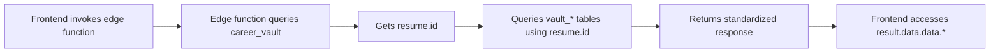

# Master Resume Naming Conventions & Developer Guide

## 🚨 Critical Rules

### Database Column Naming
- **Always use `snake_case`** for database columns
- Examples: `vault_id`, `user_id`, `created_at`, `quality_tier`
- Note: Database tables still use `career_vault` and `vault_*` prefixes for backward compatibility

### TypeScript/JavaScript Naming
- **Always use `camelCase`** for variables and interface properties
- Examples: `resumeId`, `userId`, `createdAt`, `qualityTier`

### The Most Common Bug: `vault_id` vs `vault.id`

**CRITICAL:** When querying related Master Resume tables, understand this distinction:

```typescript
// ✅ CORRECT: Query career_vault to get the resume record
const { data: resumeData } = await supabase
  .from('career_vault')
  .select('*')
  .eq('user_id', userId)
  .single();

// ✅ CORRECT: Use resumeData.id when querying other vault_* tables
const { data: powerPhrases } = await supabase
  .from('vault_power_phrases')
  .eq('vault_id', resumeData.id)  // ← Use .id, NOT .vault_id!
  .select('*');

// ❌ WRONG: This will fail because career_vault doesn't have vault_id column
const { data: powerPhrases } = await supabase
  .from('vault_power_phrases')
  .eq('vault_id', resumeData.vault_id)  // ← ERROR!
  .select('*');
```

**Why?**
- The `career_vault` table uses `id` as its primary key
- All `vault_*` tables reference this using a foreign key called `vault_id`
- When you query `career_vault`, you get `{ id: '...', ... }`
- When you query `vault_*` tables, you filter by `vault_id`

---

## 📋 Table Reference Guide

### Primary Master Resume Table
**Table:** `career_vault`
- **Primary Key:** `id` (UUID)
- **User Reference:** `user_id` (UUID)
- **Key Columns:** `resume_raw_text`, `onboarding_step`, `review_completion_percentage`

### Intelligence Tables (All use `vault_id` as foreign key)
1. `vault_power_phrases`
2. `vault_transferable_skills`
3. `vault_hidden_competencies`
4. `vault_soft_skills`
5. `vault_leadership_philosophy`
6. `vault_executive_presence`
7. `vault_personality_traits`
8. `vault_work_style`
9. `vault_values_motivations`
10. `vault_behavioral_indicators`

### Context Tables
- `vault_career_context` - Stores aggregated career intelligence
- `vault_activity_log` - Tracks user activity

---

## 🔧 Edge Function Response Standards

### Standard Response Structure

All Master Resume edge functions **MUST** return this structure:

```typescript
// Success response
{
  success: true,
  data: {
    // Your actual payload
  },
  metadata?: {
    timestamp: string;
    processingTimeMs?: number;
  }
}

// Error response
{
  success: false,
  error: string,
  details?: any,
  code?: string
}
```

### Using Type Definitions

Import and use the shared types:

```typescript
import { 
  createSuccessResponse, 
  createErrorResponse,
  AutoPopulationResult 
} from '../_shared/vault-response-types.ts';

// In your edge function
return new Response(
  JSON.stringify(createSuccessResponse<AutoPopulationResult>({
    extracted: {
      powerPhrasesCount: 10,
      transferableSkillsCount: 5,
      // ... rest of data
    },
    resumeId: resume.id,
    processingTime: 1234
  })),
  { headers: { 'Content-Type': 'application/json' } }
);
```

---

## 🎯 Common Patterns & Examples

### Pattern 1: Fetching User's Master Resume

```typescript
/**
 * Get the user's Master Resume record
 * @returns MasterResumeRecord with id, user_id, etc.
 */
const { data: resume, error } = await supabase
  .from('career_vault')
  .select('*')
  .eq('user_id', userId)
  .single();

if (error || !resume) {
  return createErrorResponse('Master Resume not found');
}

// ✅ resume.id is the resume ID
// ❌ resume.vault_id does NOT exist
```

### Pattern 2: Querying Intelligence Tables

```typescript
/**
 * Query power phrases for a Master Resume
 * CRITICAL: Use resume.id (from career_vault), not resume.vault_id
 */
const { data: phrases } = await supabase
  .from('vault_power_phrases')
  .select('*')
  .eq('vault_id', resume.id)  // ← Use resume.id!
  .order('created_at', { ascending: false });
```

### Pattern 3: Inserting New Intelligence Items

```typescript
/**
 * Insert new power phrase
 * Database expects: vault_id (snake_case)
 */
const { error } = await supabase
  .from('vault_power_phrases')
  .insert({
    vault_id: resume.id,       // snake_case in database
    power_phrase: 'Led team',  // snake_case
    quality_tier: 'gold',      // snake_case
    confidence_score: 0.95     // snake_case
  });
```

### Pattern 4: Frontend Data Access

```typescript
// Edge function returns
{
  success: true,
  data: {
    extracted: {
      powerPhrasesCount: 10,
      skillsCount: 5
    }
  }
}

// Frontend accesses
const result = await supabase.functions.invoke('auto-populate-vault-v3', {
  body: { resumeId }
});

if (result.data?.success) {
  const count = result.data.data.extracted.powerPhrasesCount;  // ✅
  // NOT: result.data.breakdown.powerPhrases ❌
}
```

---

## 🐛 Debugging Checklist

When you encounter "column does not exist" errors:

1. **Check the table schema** - What's the actual column name?
2. **Check your variable source** - Is it from `career_vault` or a `vault_*` table?
3. **Use correct reference**:
   - `career_vault` query → use `.id`
   - `vault_*` query → filter by `vault_id`
4. **Verify snake_case** - All database columns use snake_case
5. **Check response structure** - Does frontend expect the data shape you're returning?

---

## 📊 Edge Function → Frontend Flow



---

## ✅ Code Review Checklist

Before committing edge function changes:

- [ ] All database queries use `snake_case` for columns
- [ ] Variable names in TypeScript use `camelCase`
- [ ] Using `resume.id` when querying from `career_vault` result
- [ ] Using `vault_id` column when querying `vault_*` tables
- [ ] Response follows standard `{ success, data, metadata }` structure
- [ ] Added null checks for all database query results
- [ ] Using TypeScript interfaces from `vault-response-types.ts`
- [ ] JSDoc comments explain critical naming decisions
- [ ] Tested with actual data in database

---

## 🔍 Quick Reference

| Context | Use This | NOT This |
|---------|----------|----------|
| career_vault primary key | `resume.id` | `resume.vault_id` |
| vault_* foreign key | `vault_id` | `id` |
| Database columns | `snake_case` | `camelCase` |
| TypeScript variables | `camelCase` | `snake_case` |
| Edge function params | `resumeId`, `userId` | `vault_id`, `user_id` |
| Response structure | `{ success, data }` | `{ data: { breakdown } }` |

---

## 📚 Additional Resources

- **Type Definitions:** `supabase/functions/_shared/vault-response-types.ts`
- **Example Edge Function:** `supabase/functions/auto-populate-vault-v3/index.ts`
- **Database Schema:** `src/integrations/supabase/types.ts`
- **Frontend Types:** `src/types/career-vault.ts`

---

## 🆘 Getting Help

If you're stuck:
1. Check this guide first
2. Look at working edge functions for examples
3. Verify database schema in Supabase dashboard
4. Test queries in SQL editor to confirm column names
5. Add console.log to see actual data structure

**Remember:** The build errors showing "Download https://..." are just Deno downloading dependencies. They're NOT actual errors!
