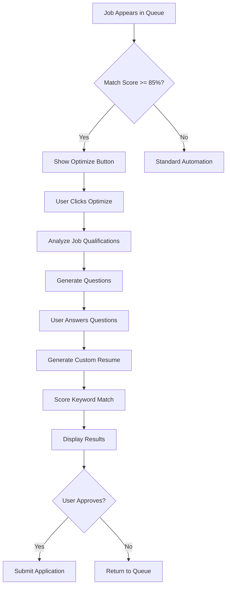

# Conversational Resume Customization System

## Overview
Your application now features an intelligent, conversational system that helps create perfectly tailored resumes for each job opportunity. Instead of generic applications, the system engages you in targeted conversations to extract your most relevant achievements and experiences.

## Key Features Implemented

### 1. **"Why Me?" Profile Builder** (Strategy Page)
**Location:** Strategy Page - New section at the bottom

**What it does:**
- Capture your success stories organized by category (Leadership, Technical Expertise, Project Management, etc.)
- Store narratives that can be referenced across multiple job applications
- AI-generated guided questions to help you articulate achievements effectively

**How to use:**
1. Navigate to the Strategy page
2. Scroll to the "Why Me? - Your Success Stories" section
3. Select a category (e.g., "Leadership", "Crisis Management")
4. Click "Get Guided Questions" for AI assistance, or write directly
5. Save your success story
6. Repeat for different categories

**Why it matters:** These narratives become a library that the system can draw from when customizing resumes for specific opportunities.

---

### 2. **Smart Job Matching with Conversation Engine** (Application Queue)
**Location:** Application Queue - Enhanced queue items

**What it does:**
- Identifies high-match opportunities (85%+ match score)
- Analyzes job descriptions to extract 3-5 most critical qualifications
- Prompts you with targeted questions about each qualification
- Generates optimized resume content based on your responses

**How it works:**
1. When a high-match job appears in your queue, you'll see a highlighted card
2. Click "Optimize Resume" to start the conversation
3. Answer 3-5 specific questions about your relevant experience
4. The system generates a customized resume emphasizing these qualifications
5. Review and approve/reject the application

**Example conversation flow:**
```
Job: Chief Technology Officer (93% Match)

Critical Qualification 1: "Enterprise digital transformation leadership"
Question: "Describe a specific digital transformation project you led. 
What was the scope, what challenges did you overcome, and what were 
the measurable results?"

[You provide detailed response]

Critical Qualification 2: "Building and scaling technical teams"
Question: "Tell me about the largest technical team you've built. 
How did you structure it, what was your hiring philosophy, and 
what outcomes did the team achieve?"

[Continue for 3-5 questions]
```

---

### 3. **Keyword Analysis & Match Scoring**
**Location:** Application Queue - Displayed in queue items after optimization

**What it does:**
- Extracts all critical keywords from job descriptions
- Scores your resume against these keywords
- Identifies missing keywords
- Provides specific improvement suggestions

**Visual Display:**
- **Coverage Score:** Percentage (e.g., 87%)
- **Keywords Found:** Green badges showing matched terms
- **Missing Keywords:** Red outline badges for gaps
- **Suggestions:** Bulleted recommendations

**Example:**
```
Keyword Coverage: 87%
✓ Found (12): Strategic Planning, Digital Transformation, 
              Agile Leadership, P&L Management...

✗ Missing (3): Six Sigma, Change Management, M&A Integration

💡 Suggestions:
• Consider adding "Six Sigma" experience if you have relevant 
  process improvement achievements
• Include "Change Management" methodology in your leadership 
  capabilities section
```

---

### 4. **Enhanced Application Queue**
**Location:** Application Queue page

**What's new:**
- High-match jobs are highlighted with "Top Match" badge
- Conversational optimization available for jobs 85%+
- Keyword analysis displayed for all customized resumes
- Before/after comparison (coming soon)
- Critical qualifications shown upfront

---

## User Workflow

### For High-Match Jobs (Recommended):
1. **Job appears in queue** with 85%+ match score
2. **Click "Optimize Resume"** to start conversation
3. **Answer 3-5 targeted questions** about critical qualifications
4. **Review generated resume** with keyword analysis
5. **Approve or refine** the application

### For Standard Jobs:
1. **Job appears in queue** with automated resume customization
2. **Review customization notes** and keyword coverage
3. **Approve or reject** the application

### Building Your Profile:
1. **Visit Strategy page** regularly
2. **Add success stories** to "Why Me?" section
3. **System remembers** these for future applications
4. **Continuous improvement** as you add more narratives

---

## Benefits

### 1. **Higher Success Rate**
- Tailored resumes that speak directly to job requirements
- Better keyword matching for ATS systems
- Quantified achievements relevant to each role

### 2. **Time Efficiency**
- Automated for standard matches
- Quick conversations (5-10 minutes) for high-value opportunities
- Reusable success story library

### 3. **Quality Control**
- See exactly what's being emphasized
- Keyword coverage transparency
- Ability to refine before submission

### 4. **Learning System**
- Builds understanding of your experiences over time
- Improves suggestions based on successful applications
- Grows more effective with each conversation

---

## Database Schema

### New Fields Added:

**profiles table:**
- `why_me_narratives` (jsonb): Stores success stories by category

**application_queue table:**
- `conversation_data` (jsonb): Stores Q&A for each application
- `keyword_analysis` (jsonb): Stores keyword scoring results
- `critical_qualifications` (text[]): Top 3-5 qualifications from job

---

## Edge Functions

### New Functions Created:

1. **analyze-job-qualifications**
   - Extracts critical qualifications from job descriptions
   - Generates targeted questions
   - Categorizes keywords

2. **score-resume-match**
   - Compares resume against job keywords
   - Calculates coverage percentage
   - Provides improvement suggestions

3. **generate-why-me-questions**
   - Creates guided questions for "Why Me?" section
   - Category-specific prompts

4. **customize-resume** (enhanced)
   - Now includes conversation context
   - Returns keyword list for scoring

---

## Future Enhancements (Ready to Implement)

### Phase 5: Learning & Personalization
- Memory system for best responses
- Success rate tracking by conversation type
- Automatic improvement suggestions
- Voice-to-text for faster responses

### Additional Features:
- Video response option
- Portfolio integration
- Reference story matching
- Industry-specific templates

---

## Tips for Best Results

### Writing Success Stories:
1. **Be specific:** Include numbers, dates, scope
2. **Show impact:** Focus on outcomes and results
3. **Tell the story:** Challenge → Action → Result
4. **Keep it concise:** 3-5 sentences per story

### During Conversations:
1. **Be detailed:** The more context, the better the resume
2. **Include metrics:** Numbers make achievements concrete
3. **Think strategically:** Connect experience to job requirements
4. **Be honest:** Only claim experience you actually have

### General:
1. **Build your library early:** Add stories as you remember them
2. **Review before approving:** Always check the final resume
3. **Update regularly:** Add new achievements as they happen
4. **Use for high-value roles:** Invest time in top matches

---

## Technical Architecture



---

## Support

For questions or issues:
1. Check keyword analysis for specific gaps
2. Review AI customization notes
3. Try rephrasing responses for better results
4. Add more success stories to your profile

---

**Version:** 1.0  
**Last Updated:** January 2025  
**Status:** ✅ Fully Implemented
